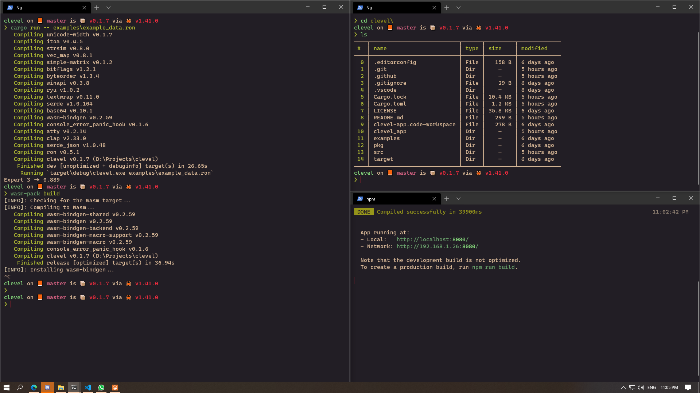

# pop-n-lock-theme-windows-terminal

This is colors from terminal in Pop N' Lock Theme by Luxcium. Go check out this amazing theme for VSCode

## Installing

1. Open your Windows Terminal Profile
2. Add contents of `pop-n-lock.original.json` to `schemes` array
3. Change `colorScheme` in your desired profile to `Pop N' Lock`
4. Also change `cursorColor` to `#C02030`

## [Original Repo for VSCode](https://github.com/Luxcium/pop-n-lock-theme-vscode)
